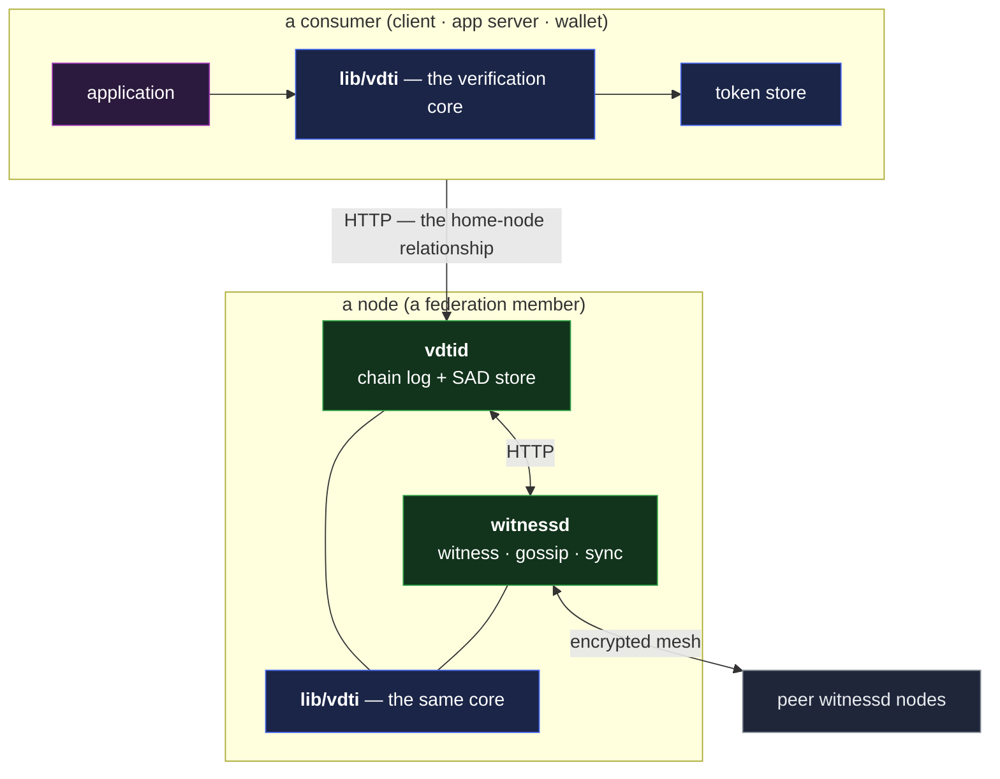

# Service architecture — one verification core, two daemons

The deployable shape of the system: a **verification core** every party links, and two thin daemons
over it — **`vdtid`**, the chain-log and SAD store ([`vdtid.md`](vdtid.md)), and **`witnessd`**, the
witness, gossip, and sync daemon ([`witnessd.md`](witnessd.md)). This doc states the decomposition
and the boundary rules that make it sound: why the verifier is a library rather than a service, what
the core owns, how consumers reach the system, and how a consumer's trust decisions stay fresh
without trusting any single node.

The framing rule for everything here is
[end-verifiability](../../system-thesis.md#end-verifiability): trust attaches to the **data** —
signed, anchored, witnessed — never to a service, a database, or a channel. The daemons are
plumbing; every correctness rule lives in the core and runs wherever the data is consumed.

## The decomposition



- **`lib/vdti`** — the verification core: the three chain verifiers and their tokens, merge, the
  transfer engine, effective-SAID computation, the deferred-dependency types, SAD custody and
  compaction, and policy evaluation. **All correctness lives here.** Both daemons link it — and so
  does **every consumer**, which is the load-bearing point (below).
- **`vdtid`** — the storage daemon: the chain log and the SAD store, merged into one service,
  hosting the node's API — submit, fetch, existence, effective-SAID, the SAD and blob paths
  ([`vdtid.md`](vdtid.md)). It runs with or without a `witnessd` beside it: a `vdtid` alone is a
  **storage node** — a mirror, or an application's replica, the nodes a replica-set SAD names
  ([`vdtid.md` §The replica-set SAD](vdtid.md#the-replica-set-sad)); adding `witnessd` is what makes
  a node a federation member.
- **`witnessd`** — the federation-facing daemon: the witness role and its signing keys, the gossip
  mesh endpoint, deferred-dependency parking, and the anti-entropy loops
  ([`witnessd.md`](witnessd.md)).
- **Clients** — build and verify locally with the core, compact before submitting
  ([`vdtid.md` §Compacted-only submission](vdtid.md#the-sad-store-write-path)), and maintain the
  consumer-side **token store** (below).

## The core is a library because consumers must verify

End-verifiability means a consumer **cannot trust `vdtid`** — a hostile or compromised daemon can
serve anything, so the consumer re-verifies every chain and SAD itself, with the **same verifier**
the daemon runs. That forces the boundary: the verifier is a **library both the daemons and every
consumer link**, never service-internal logic.

Two properties make the boundary hold:

- **The token is the proof.** The only way to consume chain data is through a verification token
  (`KelVerification` / `IelVerification` / `SelVerification`), constructable only by the verifier —
  so verification and access happen in one pass, and nothing downstream can skip the walk
  ([verification tokens](../../protocol-doctrine.md#verification-tokens-as-proof-of-verification)).
- **The database is never trusted.** A daemon re-verifies what it reads before consuming it, under
  the same advisory lock it writes with
  ([merge verification](../../protocol-doctrine.md#merge-verification-and-advisory-locking)). The
  daemon's store is a cache of the world, not an authority over it.

The daemons are therefore **thin**: `vdtid` is routing, storage, and locking around the core's
merge; `witnessd` is transport, scheduling, and key custody around the core's verification. A bug
class that lives in a daemon is an availability bug; the correctness surface is the core.

## The transfer engine — the one sanctioned data-mover

Every cross-process movement of chain events runs through the core's **transfer engine**: one paged
walk with swappable **source**, **sink**, and **verifier** — verify-into-a-sink, forward without
verifying (the receiver verifies), or stream through a callback. Merge intake, anti-entropy sync,
deferred-dependency replay, and client-side verification all reuse it.

The rule is strict because the engine is where tamper-evidence is enforced in motion: it pages in
generation-aligned units (a divergent generation spanning a page boundary re-fetches rather than
being processed half-observed) and it partitions a divergent run into sub-batches a receiving merge
handler accepts ([`witnessd.md` §Send-side partitioning](witnessd.md#send-side-partitioning)).
Hand-rolled pagination bypasses those guarantees — no other data-mover is permitted.

## The store traits — one interface, composed in sequence

The core defines a store trait per primitive — `KelStore` / `IelStore` / `SelStore` for the chain
logs, `SadStore` for standalone SADs — and every access to held data, in a daemon or a consumer,
goes through them. Implementations are interchangeable: in-memory, filesystem, database-backed (the
daemons' own), and **remote** — a `vdtid`'s API surfaced as a trait implementation.

A consumer instantiates a store over a **sequence** of implementations, searched in order — memory,
then filesystem, then one or more remotes — so caching tiers and fallback stores compose with no new
machinery: the **cascading store**. Content addressing is what makes the cascade sound — any store
returns the same bytes for a SAID or digest, so the sequence changes **where** an answer comes from
and what it costs, never what it means. Stores legitimately differ in what they _hold_: a read-gated
record lives only where its gates admit, and some data stays local-only — a miss at one tier falls
through to the next, and the serve rules hold at whichever store answers.

## Features are libraries — there are no feature daemons

Credentials, exchange, and shared documents are **libraries over the core and `vdtid`'s API**, never
daemon modules and never daemons of their own. `vdtid` takes no plug-ins and stays tight; a feature
is verification and composition logic, which end-verifiability already forces into the
consumer-linked library. Anything that genuinely wants a server — a search index, a matchmaking
service, an app-curated feed — is an **application** deploying its own app-layer service on top,
outside this architecture.

## Dependencies

Stated as plain dependencies — deployment topology (which services share an instance, what runs
where) is an operational choice, not part of the design:

- **`vdtid`** depends on **PostgreSQL** (the chain log and receipt rows), an **S3-compatible object
  store** for SAD and blob bytes (the reference deployment uses SeaweedFS), and **Redis**.
- **`witnessd`** depends on **Redis** and an **HSM** — the witness signing keys
  ([`witnessd.md` §Key custody](witnessd.md#the-witness-identity-and-key-custody)).

Redis is the coordination layer **between like processes** when a service scales horizontally —
cache, pub-sub, and the shared ephemeral state (`witnessd`'s park map, watermarks, and stale set;
`vdtid`'s cache invalidation). Data-plane durable state lives only in PostgreSQL and the object
store (key material is custodied in the HSM); merge serialization rides PostgreSQL advisory locks,
so `vdtid` replicas over one database serialize correctly with no extra machinery.

## Transport

- **Node-to-node (the mesh)** — the authenticated, encrypted channel of
  [`mesh-transport.md`](mesh-transport.md), carrying the gossip topics
  ([`../federation/topics.md`](../federation/topics.md)).
- **Everything else is HTTP** — consumer to node, and `vdtid` to `witnessd` alike. One protocol
  surface: reads use a **safe, body-carrying query method**, because a prefix in a request line or
  query string leaks into ordinary access and proxy logs
  ([negative checks](../../protocol-doctrine.md#negative-checks-are-positive-lookups)); mutations
  use POST. Keeping the daemon-to-daemon link on HTTP also keeps the two daemons **separable onto
  distinct hosts**, which the key-custody isolation below relies on
  ([`witnessd.md` §Key custody](witnessd.md#the-witness-identity-and-key-custody)).

## The consumer topology — the home node

A consumer does not roam the federation. It has a **home node** — one node it calls for everything:
chain pages, SADs, blobs, effective-SAIDs, freshness evidence. The same relationship the submit path
already runs (a user submits to a **preferred witness**, which routes on their behalf —
[`witnessd.md` §On-receiving-node routing](witnessd.md#on-receiving-node-routing)) extends to the
consume side.

The home node is a **mirror**: everything flows through it, and **nothing is trusted from it**.
Chain data end-verifies; SADs re-derive their SAIDs; receipts carry witness signatures the consumer
checks itself. A lying home node can **withhold** — which degrades to refusal or staleness, below —
but it can forge nothing.

One claim a mirror cannot self-serve is **freshness**: "no newer events exist" is not in the data a
node hands over, and a single node can withhold a newer revocation, rotation, or fork branch
indefinitely. That claim is exactly what the freshness statement carries.

## The token store — cached verification, gated reuse

A consumer caches verification tokens keyed by prefix and reuses them instead of re-walking, under
the doctrine's reuse rules
([caching and continuation](../../protocol-doctrine.md#caching-and-continuation)). The store
enforces three gates:

- **The transitive effective-SAID gate.** A cached token is reusable only when the effective-SAID of
  **every** chain it transitively leans on still matches — the KELs beneath an IEL, the IEL beneath
  a SEL, every delegator above it, and the federation that witnesses it. A lower-layer recovery can
  break an upper event while the upper chain's own value never moves; only the transitive check
  catches it. Any moved value → fetch `since` the held position and `resume` — incremental rather
  than from-scratch (a cursor the source cannot resolve, such as a fork or dispute synthetic, falls
  back to a full, re-verified re-walk —
  [caching and continuation](../../protocol-doctrine.md#caching-and-continuation)) — with the to-tip
  negative checks — revocation, rescission, divergence — re-run against the new tip.
- **The wall-clock overlay, recomputed at decision time.** The effective-SAID gate certifies
  **structure** (nothing moved ⇒ the walk stands); it does not certify **freshness**. Staleness is
  time-triggered — a witness key-window lapses with zero chain events — so the store caches
  **freshest-valid witnessing times** (data), never a fresh/stale verdict, and every loss-of-trust
  decision recomputes staleness against current wall-clock time regardless of whether anything
  moved.
- **The multi-source bar.** A **loss-of-trust decision** — is this chain forked or disputed, is this
  credential revoked, is this delegation rescinded, is this tip still current — must confirm each
  transitively-pinned chain's effective-SAID **multi-source**
  ([token reuse is transitive](../../protocol-doctrine.md#verification-tokens-as-proof-of-verification)).
  A decision that cannot meet the bar **refuses** — it never proceeds on a flag. The bar is met with
  freshness statements, below.

## The freshness statement

A **freshness statement** is a witness-signed attestation of held state: _"my held effective-SAID
for each of these prefixes is this value, as of this time."_ It is how the multi-source bar is met
through a single untrusted pipe — the independent views a loss-of-trust decision needs are **signed
data relayed by the home node**, not connections the consumer must hold open.

It is a SAD, on the same discipline as the witness receipt
([`../federation/witnessing.md` §The witness receipt](../federation/witnessing.md#the-witness-receipt)):
the witness signature rides **adjacent, never in the body**, and the timestamp sits **inside** the
signed payload so a harvested statement cannot be re-stamped fresh. Its body:

```
{
  said,           // the statement's own SAID
  kind,           // vdti/witness/v1/states/freshness
  statements,     // [{ prefix, effectiveSaid }, …] — the attested pairs, strictly ascending
                  //   by prefix, capped at MAXIMUM_MANIFEST_LIST entries (the shared list bound)
  timestamp,      // the witness's asserted time τ (inside the signed payload)
  nonce,          // optional — a consumer-supplied challenge (the live variant, below)
  witnessPrefix   // the signing witness's KEL prefix
}
```

For a chain with no single confirmed tip, `effectiveSaid` **is the verdict-tagged synthetic**
(`forked` / `disputed` —
[effective-SAID comparison](../../protocol-doctrine.md#effective-said-comparison)) — a statement can
therefore deliver "this chain is disputed" as signed evidence, and any non-single-tip value grounds
refusal directly.

**Who signs, and how a statement verifies.** Any **current federation-roster member** may sign — a
witnessed event propagates roster-wide (receipts and announcements flood; bodies follow —
[`topics.md`](../federation/topics.md)), so every member's held state is equally informative; no
per-position selection applies. A consumer counts a statement when all of the following hold,
checked with machinery it already runs for receipts:

- the signature verifies against the member's **witnessed** KEL signing key, and `τ` falls inside
  that key's window;
- the signer is in the current roster of a federation the consumer trusts (the config-pinned set),
  read from the federation IEL the consumer verifies anyway;
- `τ` is at most `now + CLOCK_TOLERANCE_BAND`, and no older than the consumer's **staleness
  threshold** for this decision.

**The bar.** A prefix's freshness is confirmed when **federation-`threshold`-many distinct current
members** agree on the same value — the `threshold` of the **federation's own witness-config**, in
effect at the consumer's verified federation tip. That is the quantity the standing byzantine
assumption is stated in ("fewer than `threshold` byzantine members" — the federation's receipting
threshold, not its governance quorum), and the signers are drawn from the whole roster, so the bar
must clear the roster-level tolerance: with byzantine members below it, any bar-meeting agreeing set
includes an honest one. What one honest signer guarantees is an honest **view as of `τ`** — an
honest member can itself lag propagation and truthfully attest a value it has not yet seen
superseded — so the bar defeats **fabrication**; propagation lag stays inside the standing
eventual-detection residual. A consumer may demand more for a high-value decision; it never accepts
fewer. A statement naming a **different** value than the consumer holds is not a failure — it is the
anti-entropy signal: fetch, verify, re-evaluate.

**Amortization.** Statements are demand-driven and cache-shaped: a witness re-signs a prefix only
when its held value moves or its cached statement ages out of its serving window (an operational
knob sized to typical consumer staleness thresholds — the consumer's own threshold governs
acceptance regardless), the home node gathers federation-`threshold`-many over its existing mesh
sessions and re-serves the bundle to every consumer behind it, and the multi-prefix `statements`
list covers a decision's whole transitive dependency set in one signature per witness — per
federation: a chain clears the bar of the federation that witnesses it, so a set spanning
federations gathers from each. Nothing floods — statements move by request and cache, unlike
receipts. The staleness threshold is the cost dial: tighter freshness buys proportionally more
signing.

**The live variant.** A consumer that cannot trust its own clock — or wants replay bounded to a
single exchange rather than a staleness window — supplies a **`nonce`**, and the statement is signed
fresh with the nonce inside the payload (the challenge-response path
[`../federation/witnessing.md`](../federation/witnessing.md) names for the no-local-clock case). The
live variant defeats caching by construction, so it is the high-assurance opt-in, never the default.

**Relationship to the beacon and to monitoring.** The receipt query at a position (the beacon)
enumerates a position's competing branches to nodes; the freshness statement is how a **node's
resulting held view exits the federation to a consumer** with its provenance intact. The owner-side
twin is [`monitoring.md`](../../monitoring.md) — the same effective-SAID compared against the
owner's own expectation rather than a peer's.

## Adversarial framing

- **A hostile home node can only starve, never feed.** Every byte it serves end-verifies; freshness
  statements are signed by keys it does not hold. Withholding chain data is denial; withholding
  statements makes the bar unmeetable → the decision **refuses** (fail-secure). Serving stale
  statements fails the consumer's staleness check; serving a stale _value_ under fresh signatures
  requires the signing members themselves to lie — the next point.
- **Forging agreement costs the federation itself.** Fabricating "still current" for a chain that
  moved requires **federation-`threshold`-many** distinct current-member signatures — exactly the
  federation's own byzantine bar, so any bar-meeting agreeing set contains an honest signer and a
  stale-value set cannot be assembled below the federation-compromise class (the same arithmetic
  closes the withhold-honest-while-supplying-byzantine channel: the byzantine members alone can
  never reach the bar). It is the system's irreducible residual, and **detectable after the fact**:
  the signed statements are durable evidence contradicting the chain.
- **The federation chain's own freshness rides the same bar.** A cut-out quorum attesting a stale
  roster as current is bounded by the key-window auto-expiry (`MAXIMUM_WITNESS_KEY_WINDOW`) and
  broken by a single honest member's statement (disagreement → fetch). Sustaining the illusion is a
  full eclipse plus a byzantine quorum — the standing
  [eclipse residual](../../residuals.md#3-eclipse-and-freshness), degraded to refusal past the
  window.
- **Replaying a statement is bounded by its `τ`.** The timestamp is inside the signed payload, so a
  harvested statement ages out at the staleness threshold; the nonce variant closes replay entirely
  for the decisions that warrant it. A backward-drifting consumer clock re-opens the window — the
  standing NTP deployment invariant
  ([`residuals.md`](../../residuals.md#consumer-clock-drifts-backward)).
- **The library boundary is the trust boundary.** No daemon-side check is load-bearing for a
  consumer: a compromised `vdtid` or `witnessd` yields wrong availability, wrong caching, wrong
  routing — never a wrong verified answer downstream, because the consumer's own linked core
  re-derives every answer that matters.

## Cross-references

- [`vdtid.md`](vdtid.md) — the chain-log and SAD store daemon: the API, the merge write path, the
  serve-by-SAID rule.
- [`witnessd.md`](witnessd.md) — the witness, gossip, and sync daemon: receipts, parking,
  anti-entropy, freshness-statement service.
- [`mesh-transport.md`](mesh-transport.md) — the authenticated, encrypted node-to-node channel.
- [`../../protocol-doctrine.md`](../../protocol-doctrine.md) — operation categories, verification
  tokens, caching and continuation, effective-SAID comparison.
- [`../federation/witnessing.md`](../federation/witnessing.md) — receipts, the witnessing floor, the
  clock and key-windows, query-scoping.
- [`../../monitoring.md`](../../monitoring.md) — the owner-side effective-SAID watcher.
- [`../../primitives/data/sad/kinds.md`](../../primitives/data/sad/kinds.md) — the identifier
  catalogue the freshness-statement kind joins.
- [`../../residuals.md`](../../residuals.md) — eclipse and freshness residuals; cross-cutting
  assumptions.
