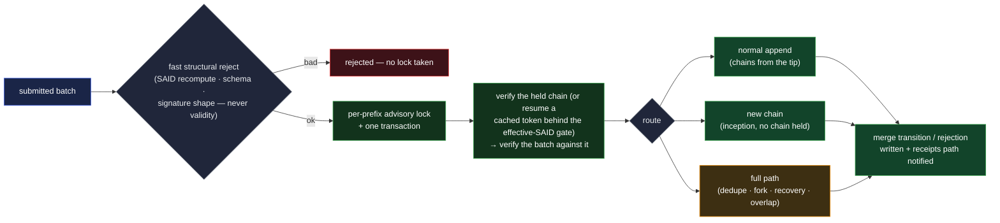

# logsd — the chain-log daemon

`logsd` is the chain-log daemon: it holds a node's event logs and their receipts, runs the merge
write path under advisory locking, and serves accepted chain state with its receipts. It deploys the
[`LogServer`](../../compositions/log-server.md) composition over a
[`LogStore`](../../primitives/stores/log-store.md), and runs beside [`sadd`](sadd.md),
[`witnessd`](witnessd.md), and [`gossipd`](gossipd.md) as part of a **federation node**
([`architecture.md`](architecture.md#the-decomposition)). It is deliberately **thin**: every
correctness rule it enforces lives in the composition and the verification core; `logsd` contributes
routing, storage, and locking.

**Why the split holds where one service was argued.** Verification leans on the SAD store — a walk
interleaves chain reads with targeted SAD lookups (the witness-config and roster in effect at a
position, the manifests its pin locators lead to), and the merge runs that path constantly. Two
things keep the split from putting a cost inside the verifier's hottest dependency. The **network
hop never appears**: a server composes **stores**, never other servers — `logsd` resolving a
manifest role-SAD reaches the `SadStore` **directly**, a read, with no RPC
([`log-server.md`](../../compositions/log-server.md)). And **write-path atomicity survives**: an
anchor and the SAD it commits land in one transaction because co-deployed servers share one
PostgreSQL; where they run as separate scaling units, the **deferred-dependency parking** the server
already runs covers the gap — exactly as rooting relies on it for cross-chain races.

## The merge write path

Every write into a chain runs through the merge layer — one entry point for direct submissions,
gossip propagation, and sync alike
([`log-server.md` §The merge layer](../../compositions/log-server.md#the-merge-layer--every-durable-event-write)):

- **Fast reject before the lock.** SAID recomputation, schema validation, and signature-**shape**
  checks (present, well-formed, one per event) run up front, so junk never contends for the lock.
  Signature **validity** cannot be checked here: the verifying key is the chain's current key state,
  known only from the verified walk under the lock — SAID recomputation needs no keys, which is
  exactly why it can run first. The **blocked-author fast-reject** runs here too (§Request bounds).
- **Advisory lock, one transaction.** All verify-then-write work for a prefix holds a per-prefix
  database advisory lock for the duration of both verification and write — the chain is verified
  under the lock, the batch verified against that token, and the write lands in the same
  transaction, never re-querying between check and use
  ([merge verification](../../protocol-doctrine.md#merge-verification-and-advisory-locking)). The
  lock is per-prefix, so replicas over one database serialize per chain and scale across chains.
- **The database is never trusted.** Verification is recomputed on every merge — a cached token
  short-cuts the re-walk **only** behind the effective-SAID reuse gate, and a `resume` re-runs the
  to-tip negative checks
  ([caching and continuation](../../protocol-doctrine.md#caching-and-continuation)).
- **Routing and outcomes are the merge layer's.** Normal append (the common case), new chain, or the
  full path (dedupe, fork formation, recovery, overlap), returning the merge-outcome vocabulary the
  primitives define — transitions (`Extended` / `Recovered` / `Terminated` / `Forked` / `Disputed`)
  and rejections (`Sealed` / `Buried` / `Terminal` / `Invalid` / `Ignored`), with sub-threshold
  submissions held `deferred-pending`
  ([`kel/merge.md` §Merge outcomes](../../primitives/data/event-logs/kel/merge.md#merge-outcomes)).
  Admission dispatches on the root kind, and acceptance criteria dispatch per class
  ([`log-server.md` §The admission dispatch](../../compositions/log-server.md#the-admission-dispatch--three-legs-on-the-root-kind)).

**Effective-SAID service.** The value is a pure function of held state, computed on demand — never a
stored flag ([`log-store.md`](../../primitives/stores/log-store.md)). The seal-cap bounds the
computation: every live tip sits within one page of the chain head (a live fork can only form above
the last seal, and the post-seal window is capped), so the tip-enumeration and duplicate-serial
checks run windowed, O(page) on an indefinitely long chain. A post-merge cache refresh and pub-sub
notification (Redis, between replicas and to `witnessd`) is a latency optimization, never a
correctness mechanism.

## Deferred dependencies — the typed response

An event can arrive before something it depends on lands on **another** chain — an IEL event before
its member's KEL anchor, a SEL event before its owner-IEL anchor, an anchor before its SAD — because
chains propagate independently. This is a **race, not an error**, and it gets a typed answer, not a
rejection:

- The verifier runs in **collect mode**: deferrable failures — a missing dependency event, a missing
  anchor, a missing SAD — accumulate as reported context while the walk continues, rather than
  halting it.
- `logsd` returns a **deferred-dependencies response**, structurally distinct from a rejection: the
  batch is parseable and plausibly valid, but cannot be admitted yet. Each missing dependency is
  tagged with its chain's **current effective-SAID as held here** — for a non-single-tip chain, the
  verdict-tagged synthetic — so the parker can later tell "that chain moved" from "still waiting."
- The batch parks in the **server composition's park map** over shared infra and replays through the
  full merge path when the dependency lands; `gossipd` contributes the drain triggers it observes on
  the mesh
  ([`log-server.md` §Deferred-dependency parking](../../compositions/log-server.md#deferred-dependency-parking)).

A submission whose **federation context** is missing is a different case — it gets the
**`unresolvable`** refusal, naming the federation prefix and which condition holds, never the
deferred response (that park would never drain —
[`log-server.md`](../../compositions/log-server.md#the-admission-dispatch--three-legs-on-the-root-kind)).

## The chain read — keep all data, serve the accepted

Retention is **keep-all-data**: burial is a **status, never deletion** — a buried content loser
stays reachable here (and only here — never by SAID), and nothing accepted is ever removed
(`architecture.md` §Dependencies). Serving is governed by the composition's two rules
([`log-server.md` §Serving](../../compositions/log-server.md#serving--the-acceptance-gate-and-the-spine)):
**serve iff accepted** (or an ancestor of an accepted event this node holds), and, on the default
path, **serve the spine** — below the last clean seal the spine only; at-or-above it, up to the seal
frontier — by descending seals, never scanning or ascending by serial, so a page's cost follows the
chain's rotation count, never its buried population.

The full retained set stays reachable through the **two orthogonal serve flags**
([`log-server.md` §The two serve flags](../../compositions/log-server.md#the-two-serve-flags--non-canonical-and-sub-threshold-orthogonal)):
**`non-canonical`** lifts the cost boundary (everything held off the served spine —
accepted-and-dead, verifiable, skewing nothing), and **`sub-threshold`** lifts witness-scoping
(events that never reached threshold — an audit obligation attaches). So a full-history walk, an
auditor, and a fork-forensics read all get truthful answers — off the default path.

The by-prefix read is paged in canonical order `(serial, kind sort-priority, said)` with a
`has_more` indicator and a `since` cursor for incremental fetch. **Receipts are bundled with each
page** — flat rows keyed at `(prefix, serial)`, served without verification (the consumer re-checks
signatures), off-spine receipts leaving the default page with their events. Bundling matters for
divergence detection: the receipts at a position enumerate the witnessed branches admitted there
(the beacon — bounded at two attested events per signer per position, always covering the
dispute-proving pair), so a one-branch holder learns competing branch SAIDs from the same response
that pages the chain, with no second round-trip.

**Query-scoping is enforced at serving.** A sub-threshold witnessed-class event is returned only to
a selected witness for its position; to every other requester it is withheld — which is what keeps a
non-witness holding only witnessed-in-full events of the witnessed classes (an `Fcp`-rooted chain's
unwitnessed steps are accepted on the admission dispatch's own grounds —
[`witnessing.md` §Query scoping](../federation/witnessing.md#query-scoping-and-the-serve-flags)). On
the mesh surface the same scoping is [`gossipd`](gossipd.md)'s, enforced on the wire where the
peer's identity is already authenticated.

## Request bounds and rate limits

Every request surface is bounded, and the limits are **operator knobs over a structural floor** —
the hard resilience guarantee is the retention bound and the caps the primitives carry, never the
rate limiter ([`residuals.md`](../../residuals.md#9-availability-caps-and-dos-bounds)):

- **Request bounds.** A submit batch is capped at one page; request bodies carry a hard size cap;
  every read's page limit clamps to the page size.
- **A per-IP token bucket** on writes — a refill rate and a burst ceiling.
- **A per-prefix daily event budget**, counted in **events, not submissions**, applied in two steps:
  the **check** runs before the merge, with the candidate count, ahead of the lock — an over-budget
  batch never contends — and the budget **accrues** after the merge with the count of events
  actually inserted, so a deduplicated resubmit accrues nothing and idempotent redelivery is never
  taxed.
- **Blocked-author fast-reject.** A submission whose **authoring prefix reads blocked** by this
  federation is rejected **before the merge lock**, alongside the other pre-lock checks
  ([`../federation/blocking.md` §Serve, block, and store](../federation/blocking.md#serve-block-and-store)).
  It is a witnessing-side refusal — a block withholds advancement, never information — so it never
  touches the serve path: held data is still served, end-verifiable.
- **Bounded bookkeeping.** The limiter and nonce tables are swept by a periodic reaper, so
  attacker-generated keys — fresh prefixes, fresh addresses — cannot grow them without bound.

## Scaling

`logsd` is stateless over its stores: replicas share one PostgreSQL, per-prefix advisory locks
serialize merges per chain, and Redis carries the cross-replica cache invalidation and post-merge
pub-sub. Nothing in the daemon holds per-consumer session state — a consumer's continuity lives in
its own token store.

Liveness and readiness are **distinct probes**: a node reports **ready** only once its
[`gossipd`](gossipd.md) has finished bootstrapping into the mesh — a fresh replica that served
before syncing would answer with confidently stale state, so readiness gates serving on the sync
engine having caught up.

## Public face

The public dial is **authenticated against the node's KEL**: the node publishes a **transport-key
SAD** carrying a **validity window**, signed by a key that is **current** in the node's KEL and
re-signed on a timer; the client verifies it against the node's KEL, then runs an ephemeral-KEM
handshake in which the transport key **signs** and is **never encapsulated to** — this is not the
receive-key-directory pattern (a receive key is a KEM key; encapsulating to a long-lived transport
key would break forward secrecy). Reads use a safe, **body-carrying** query method and mutations use
POST — the log-leak rationale is [`architecture.md` §Transport](architecture.md#transport). Serving
requires no verification — the receiver verifies what it gets
([operation categories](../../protocol-doctrine.md#operation-categories)). The consumer surface is
the chain half: **submit events** (a batch of chain events with adjacent signatures and any receipts
that arrived with them — a merge transition, a merge rejection, or the typed deferred-dependencies
response), the **chain read** (by prefix, paged, receipts bundled), and the **effective-SAID query**
(a real tip SAID, or the verdict-tagged synthetic —
[effective-SAID comparison](../../protocol-doctrine.md#effective-said-comparison)). The mesh surface
— replication and sync — is [`gossipd`](gossipd.md)'s, not this daemon's public face.

## Adversarial framing

- **A compromised `logsd` cannot mint trust.** It holds no witness keys (receipts and freshness
  statements are signed in `witnessd` —
  [key custody](witnessd.md#the-witness-identity-and-key-custody)), and everything it serves
  end-verifies. Its full attack surface is availability and staleness — both of which the
  consumer-side freshness machinery converts to refusal
  ([`architecture.md`](architecture.md#adversarial-framing)).
- **A tampered database is caught at the next consume.** Merge re-verifies under the lock; consumers
  re-verify what they fetch; a tampered row surfaces as a SAID or signature mismatch, fail-secure
  ([the verifier is the trust boundary](../../system-thesis.md#the-verifier-is-the-trust-boundary)).
- **Submission is idempotent and bounded.** Dedupe is by SAID (a byte-identical resubmit is the same
  event); the fast structural reject runs before the lock; page and list caps bound every walk the
  daemon runs on behalf of a request.

## Cross-references

- [`../../compositions/log-server.md`](../../compositions/log-server.md) — the composition this
  daemon deploys: the merge layer, admission dispatch, receipt gate, promotion, serving, parking,
  token bundles.
- [`../../primitives/stores/log-store.md`](../../primitives/stores/log-store.md) — the dumb store.
- [`architecture.md`](architecture.md) — the decomposition, the transfer engine, the token store,
  the freshness statement.
- [`witnessd.md`](witnessd.md) — the verify-then-sign daemon beside this one;
  [`gossipd.md`](gossipd.md) — the sync daemon whose loops drive the mesh surface.
- [`../../primitives/data/event-logs/kel/merge.md`](../../primitives/data/event-logs/kel/merge.md) —
  the merge outcomes and routing this daemon runs (IEL and SEL analogues in their own docs).
- [`../../protocol-doctrine.md`](../../protocol-doctrine.md) — operation categories, advisory
  locking, negative checks, effective-SAID comparison.
- [`../federation/witnessing.md`](../federation/witnessing.md) — receipts, the beacon,
  query-scoping.
