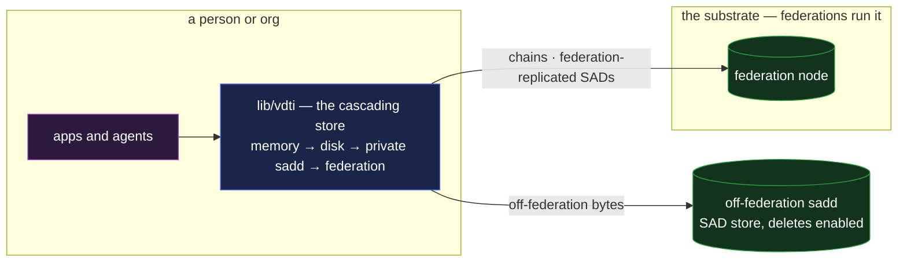

# sadd — the SAD store daemon

`sadd` is the SAD store daemon: it holds standalone SADs, admits them under the rooting floor, and
serves them under the layered serve gates. A federation runs it beside the chain-log daemon with
deletes disabled; a person or organization runs it **off-federation** as a storage tier of its own —
the store a client's cascading store reaches for the bytes the federation does not hold, still
addressed and verified with the same content-addressed model as everything else.

## Deployment

The image is dropped in wherever the operator wants a storage tier — a personal device, a home
region, an org's private network. A client's **cascading store**
([`architecture.md` §The cascading store](architecture.md#the-cascading-store--one-interface-composed-in-sequence))
searches its tiers in order — memory → disk → private store(s) → the federation, for what the
federation holds — and a fetch is answered by whichever tier holds the bytes, the serve rules
identical at each.

## The composition

- **It exposes the store half, not the chain half.** `sadd` deploys the
  [`SadServer`](../../compositions/sad-server.md) composition over a
  [`SadStore`](../../primitives/stores/sad-store.md): the SAD write / fetch and the `deposits`
  discovery poll — never `submit events`, receipts, or the gossip mesh. `sadd` is a store, not a
  witness.
- **The cascading store is the routing signal.** There is no per-SAD placement field: the client
  decides which of its **own** tiers a write lands on — local, a private store, a service's
  replicated roster — and off-federation data is written there, never submitted. What reaches the
  federation is fixed by the verification-necessary test, never by client choice: a grant value or
  manifest is submitted and replicates across **all** the federation's witnesses; application data
  has no federation tier to choose
  ([`architecture.md` §The cascading store](architecture.md#the-cascading-store--one-interface-composed-in-sequence)).
  One object model expresses both placements.
- **Everything still verifies, and running a server IS the admission floor.** An off-federation
  `sadd` is untrusted like every store — bytes content-addressed, the consumer verifying what it
  fetches through the same core library. No deploy knob turns admission off (a bare store with no
  server is a cache tier, where the client placed what is there); the floor is **dispatched on the
  committing-doc context** ([`sad-server.md`](../../compositions/sad-server.md)), and every check
  the store cannot settle from its own holdings it settles as an **end-verifying consumer of the
  federation** — it composes a federation client configured with the set of trusted federation
  prefixes, queries public federation data, and verifies what it gets; a requester bound outside
  that set is **`unresolvable`**, fail-closed. A custody `readers` gate it enforces resolves the
  read-authorization **SEL against a chain** the same way — the gate is real but leans on federation
  state, not on the store. Moving data between stores is cost, not trust
  ([`../../system-thesis.md` §End-verifiability](../../system-thesis.md#end-verifiability)).

## The SAD store write path

- **Submission form.** A SAD is submitted inside a rooting envelope
  ([`rooting.md` §The submission](../../primitives/data/sad/rooting.md#the-submission)) and may
  travel **compacted or expanded** — the write path recomputes the SAID over the **fully-compacted**
  form the SAID is defined over ([`compaction.md`](../../primitives/data/sad/compaction.md)),
  recompacting an expanded body and verifying each child, and rejects a mismatch. Bulk bytes are not
  this daemon's: a payload lives on a [`blobsd`](blobsd.md), committed by storage key.
- **The kind gate.** `kind` is required on every SAD, and the write path **rejects event kinds
  outright** (`vdti/{kel,iel,sel}/v1/events/*`) — events live in the chain log, reached by prefix,
  and keeping their bodies out of the store is what makes the serve rule below physically unable to
  leak one.
- **The admission floor, dispatched on the committing-doc context**
  ([`sad-server.md` §Admission](../../compositions/sad-server.md#admission-is-three-things-not-one)).
  On the **federation face**: an **event root** (a chain event's `manifest` / `pins` — the
  owner-anchor its blinded instance, verified as one transaction with its anchoring event) or a
  **SAD-field root** (an accepted parent SAD's committed child, whose `availability` the store
  checks **covers** the child's — `root ⊇ child`,
  [`availability.md`](../../primitives/data/sad/availability.md#a-root-covers-its-children)); a
  submission with **no root is refused** — no anonymous class exists on the federation
  ([`rooting.md`](../../primitives/data/sad/rooting.md)). **Off-federation**: the `senderPin`
  envelope signature for an inbox deposit, the `chat-membership` per-requester check for a
  chat-gated deposit, the submitter's **own live signature** for an unrooted root — with the
  operator's own policy on top. The store keeps no reverse index and never inverts an identifier to
  find a root; a root that has not landed yet parks in the deferred-dependency queue and drains when
  it arrives.
- **Availability enforcement is per-deployment.** A **federation** `sadd` **refuses** a submission
  declaring `expiry` or `once`, and runs with deletes **off** — the federation is the permanent
  record. An **off-federation** `sadd` enforces both axes — `expiry` garbage-collects past its
  instant, a `once` SAD is removed on first successful read; expired, consumed, and never-existed
  are one uniform "not present" — and runs `delete(said)` under the **deploying application's
  predicate** ([`sad-server.md`](../../compositions/sad-server.md#availability-and-deletes)).

## Serve-by-SAID — an enforced rule, not a convention

[`kinds.md` §Fetch by SAID](../../primitives/data/sad/kinds.md#fetch-by-said--what-the-store-hands-back)
states the rule; **this daemon is its enforcement point**, and the rule is load-bearing for privacy,
not storage hygiene. A refused fetch is the uniform **"not present"** — gated, expired, consumed,
and never-existed are one answer, so a refusal never leaks what a fetch would have found, and there
is **no second way to ask**: no existence probe answers the question a fetch just refused. The
principle: **nothing whose SAID must stay opaque is fetchable by SAID.** An event SAID travels in
the open as a commitment — inside a public identity's `anchors[]` — and an event body reached by
SAID would let an observer walk those commitments back to the private chains they stand for (a
lookup-SEL's revocation entries, an issuer's kill targets), turning the store into the inversion
oracle that referencing events by prefix exists to deny.

Enforcement is layered, default-deny — the serve gate is **three gates**
([`sad-server.md` §The serve gate](../../compositions/sad-server.md#the-serve-gate-is-three-gates)):

- **Write path** — event kinds never enter the SAD store (the kind gate above), so an event body
  **cannot** be served by SAID even by misconfiguration: the bytes are not there.
- **Serve path** — a by-SAID fetch is answered only for kinds on the served list (commitment SADs,
  grant values, policy and framework SADs, content kinds), then gated by the SAD's own custody
  `readers`, then by any owning feature's **serve-time gate** on the signed request (the chat
  message's membership check — [exchange](../../features/exchange.md#reserved-names)). Everything
  else — an unknown kind, a future free-floating type — is refused, indistinguishable from absent.
- **Chain path** — events are served **by prefix only**, through [`logsd`](logsd.md)'s chain read;
  there is no SAID-to-event index anywhere in the store.

**Enumeration is never on a public face.** `enumerate(since)` is in-process or mesh-scoped only
([`sad-store.md`](../../primitives/stores/sad-store.md)); an off-federation `sadd` exposes **no
enumeration at all** — its only listing is the recipient-scoped, gated `deposits` query.

## Readiness

A **federation** node reports ready only once its [`gossipd`](gossipd.md) has completed the cold
preload — a fresh replica that served before syncing would answer with confidently stale state
([`logsd.md` §Scaling](logsd.md#scaling)). An **off-federation** `sadd` has no sync engine and holds
no chain state of its own, so it reports ready immediately: its staleness surface is the cold-read
federation coupling of its gates, which fails **closed** rather than answering stale.

## Request bounds and rate limits

Every request surface is bounded: request bodies carry a hard size cap, every read's page limit
clamps to the page size, a **per-IP token bucket** governs writes, and admission's rate identity is
the party the floor produced — the anchoring owner, the `senderPin` identity, the resolved chat
member, or the live-signing submitter — blinded to a local **sliding counter**
(`rateTarget = hash('…/rate:{prefix}')`; over-cap refuses). A live-signed submission's signature
covers a **fresh timestamp**, checked against the clock band, and there is **no replay set**: every
stored object is content-addressed, so a replayed submission re-stores identical bytes and changes
nothing — rate plus freshness cover the space with one blinded key. Limiter and nonce tables are
swept by a periodic reaper, so attacker-generated keys cannot grow them without bound.

## Public face

The public dial is **authenticated against the node's KEL**: the node publishes a **transport-key
SAD** carrying a **validity window**, signed by a key that is **current** in its node KEL and
re-signed on a timer; the client verifies it against the node's KEL, then runs an ephemeral-KEM
handshake in which the transport key **signs** and is **never encapsulated to** (not the
receive-key-directory pattern — a receive key is a KEM key, and that reading breaks forward
secrecy). A fleet deployment is a member device of the service's IEL
([`architecture.md`](architecture.md)).

## Scenarios

- **A personal store.** A person runs an off-federation `sadd` on a home device; their
  [`pds`](../../example-applications/pds.md) records live there, indexed by the person's own chains,
  fetched by any of their devices through the cascade.
- **A private drive tier.** A [`drive`](../../example-applications/drive.md) keeps a home-region
  store as a fast, private tier; published files still replicate, private ones stay on the private
  store.
- **An inbox.** A recipient's mail lands on the stores their mail service runs — off-federation
  deposits to the service the recipient named
  ([`../../features/exchange.md` §Addressing and delivery](../../features/exchange.md#addressing-and-delivery--scoped-to-the-recipients-own-nodes)).

## What this validates

- **Off-federation storage needs no new protocol.** The same SAD model, the same custody gate, the
  same verification — an off-federation `sadd` is a deployment shape, not a new primitive. "Storage
  is a tier, trust is the data" holds at the edge of the federation as it does inside it.
- **The federation stays the witness set, uncomplicated.** A federation replicates every SAD it
  admits across all its witnesses — there is no per-object placement field to carry or resolve — and
  what it admits is fixed by the verification-necessary test, never by client choice: application
  data has no federation tier to choose ([`rooting.md`](../../primitives/data/sad/rooting.md)).

## Limits

- **An off-federation `sadd` witnesses nothing.** It cannot advance a chain, mint a receipt, or
  vouch for freshness — it only stores and serves. Witnessing belongs to the chains: an application
  that needs a witnessed fact anchors it, and the anchored data stays here.
- **At-rest privacy from the store operator is client-side encryption** — the same limit `drive` and
  `pds` state; `readers` gates the serve, encryption protects the bytes.
- **Availability is the operator's.** A store taken offline takes its off-federation data with it;
  redundancy across several tiers, or the replicated service shape mail demonstrates
  ([`mail.md`](../../example-applications/mail.md)), is the operator's call.

## Cross-references

- [`../../primitives/data/sad/availability.md`](../../primitives/data/sad/availability.md) — the
  `{ expiry, once }` axes that still govern a SAD held off-federation.
- [`architecture.md`](architecture.md) — the node decomposition and the cascading store traits that
  route placement.
- [`../../compositions/sad-server.md`](../../compositions/sad-server.md) /
  [`../../primitives/stores/sad-store.md`](../../primitives/stores/sad-store.md) — the composition
  this daemon deploys, and the dumb store beneath it.
- [`logsd.md`](logsd.md) — the chain half of the node; the chain path routes there.
- [`gossipd.md`](gossipd.md) — the sync daemon; federation readiness gates on its cold preload.
- [`../../example-applications/pds.md`](../../example-applications/pds.md) /
  [`../../example-applications/drive.md`](../../example-applications/drive.md) /
  [`../../features/exchange.md`](../../features/exchange.md) — the compositions that place data on
  an off-federation store.
