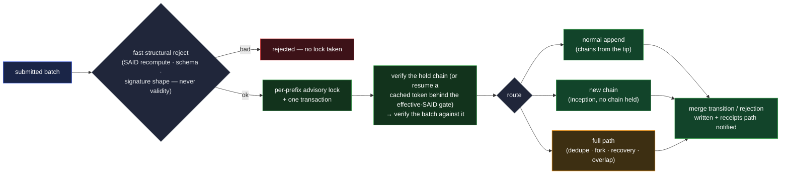

# vdtid — the chain-log and SAD store daemon

`vdtid` is the storage daemon: **one service holding both the chain log and the SAD store**, hosting
the node's API. It runs the merge write path under advisory locking, enforces the storage-boundary
rules the data layer declares — the serve-by-SAID allowlist, custody read gates, availability — and
serves chain pages with their receipts. It is deliberately **thin**: every correctness rule it
enforces lives in the verification core ([`architecture.md`](architecture.md)); `vdtid` contributes
routing, storage, and locking.

**Why one service.** Verification leans on the SAD store: a walk interleaves chain reads with
targeted SAD lookups — the witness-config and roster in effect at a position, the specific manifests
its pin locators lead to — and `vdtid` runs that path constantly (every merge re-verifies under the
lock). Splitting the chain log from the SAD store would put a network hop inside the verifier's
hottest dependency and split the write path's atomicity (an anchor and the SAD it commits should
land in one transaction). So the store and the chain log are one service — and a `vdtid` deployed
without a `witnessd` **is** the store-only storage node
([`architecture.md`](architecture.md#the-decomposition)); there is no separate store service.

## The API surface

Reads use a safe, **body-carrying** query method and mutations use POST — the log-leak rationale is
[`architecture.md` §Transport](architecture.md#transport). Serving requires no verification — the
receiver verifies what it gets
([operation categories](../../protocol-doctrine.md#operation-categories)). The surface splits by
audience: **public** endpoints serve consumers through the home-node relationship; **mesh**
endpoints serve federation peers, and exist for replication and sync.

### Public endpoints — the consumer surface

| Endpoint           | Method | Carries / returns                                                                                                                                                                                                                                                                                                                                                                                                                                                                                                                                         |
| ------------------ | ------ | --------------------------------------------------------------------------------------------------------------------------------------------------------------------------------------------------------------------------------------------------------------------------------------------------------------------------------------------------------------------------------------------------------------------------------------------------------------------------------------------------------------------------------------------------------- |
| **submit events**  | POST   | a batch of chain events with adjacent signatures (and any receipts that arrived with them); runs the merge write path; returns a merge transition, a merge rejection, or the typed deferred-dependencies response (below)                                                                                                                                                                                                                                                                                                                                 |
| **submit SAD**     | POST   | a standalone SAD (compacted or expanded) inside a rooting envelope; SAID-checked, kind-gated, rooted (below)                                                                                                                                                                                                                                                                                                                                                                                                                                              |
| **upload payload** | POST   | bulk bytes uploaded **against a committing SAD already deposited** — the store reads that SAD's committed digest, hashes the blob and requires a match, checks a client nonce + timestamp (clock tolerance band; a bounded unseen-nonce cache closes replay), and authenticates the uploader per the committing kind — one round trip, idempotent (a replay re-stores identical bytes); the store never holds a blob nothing committed to ([exchange §The payload](../../features/exchange.md#the-payload--named-by-digest-uploaded-against-the-message)) |
| **chain**          | QUERY  | a chain's events by prefix — paged, with a `since` cursor for incremental fetch, **receipts bundled with each page**; the response carries the **full retained set after the cursor** (competing branches live or since-settled, the burying seal-advancer, the cursor's own siblings), and with no cursor the whole retained set in canonical order (below)                                                                                                                                                                                              |
| **effective-SAID** | QUERY  | a prefix's effective-SAID — a real tip SAID, or the verdict-tagged synthetic ([effective-SAID comparison](../../protocol-doctrine.md#effective-said-comparison))                                                                                                                                                                                                                                                                                                                                                                                          |
| **exists**         | QUERY  | an existence probe by SAID — answered **under the serve gates**: "held" only where a fetch by this requester would succeed, everything else the uniform "not present" (the peer-scoped wider answer is a mesh endpoint, below)                                                                                                                                                                                                                                                                                                                            |
| **SADs**           | QUERY  | standalone SADs by SAID — a **bounded list in one request**, a one-element list the single-SAD fetch; each entry is gated individually (the serve-by-SAID allowlist, the custody `readers` gate, any feature serve-time gate — below) and a refused or absent entry reads uniformly "not present". The batch is the walk-support shape: a page walk resolves a bounded set of commitment SADs (pin-located manifests, rosters, witness-configs) in one round trip                                                                                         |
| **blob**           | QUERY  | bulk bytes by digest — the committing SAD's gate decides: an exchange blob only to a **live-signed request** proving a device of the recipient identity (an IEL-roster check, single-device); a chat blob only to a live-signed current member (the membership check); a **public** wrapper's blob per its custody — ungated when public. The request gate is load-bearing for the gated cases because a bare blob carries no `custody` of its own                                                                                                        |
| **deposits**       | QUERY  | the discovery poll: enumerate the SADs deposited **for an identity** at this node (a recipient's mail inbox), live-signed by a current member device of that identity, `since`-cursored                                                                                                                                                                                                                                                                                                                                                                   |
| **acknowledge**    | POST   | a recipient's delivery acknowledgment for a deposited message — the origin node deletes the bytes (the explicit-ack complement to `availability`'s `once` and `expiry`)                                                                                                                                                                                                                                                                                                                                                                                   |
| **freshness**      | QUERY  | a freshness-statement bundle for a set of prefixes (optionally nonce-bearing); signed and gathered by `witnessd`, relayed and cached here — the statements end-verify, so the relay is untrusted plumbing ([`architecture.md`](architecture.md#the-freshness-statement))                                                                                                                                                                                                                                                                                  |
| **all-data**       | QUERY  | the opt-in forensic audit query: every event and receipt held, sub-threshold included — safe to surface because no verifier's walk ever feeds a sub-threshold event into a verdict; purely forensic ([query-scoping](../federation/witnessing.md#query-scoping-and-the-audit-flag))                                                                                                                                                                                                                                                                       |

**Query-scoping is enforced at serving.** A sub-threshold event is returned only to a selected
witness for its position; to every other requester it is withheld — which is what keeps a
non-witness holding only accepted state. The `all-data` audit query is the one scoped exception.

**Feature-configured gates carry no feature logic.** The upload and serve gates above dispatch on
the **committing SAD's kind**, and every check they run is a core primitive — an IEL-roster proof, a
membership-SEL resolution, a custody `readers` gate — through the same verifiers everything else
uses. The daemon links no feature code: a feature configures the store through its kinds and its
data, which is what keeps
[no feature daemons](architecture.md#features-are-libraries--there-are-no-feature-daemons) true —
the store-side half of a feature is entirely these generic mechanisms.

### Mesh endpoints — the federation-peer surface

Federation peers reach a second surface, authenticated by the mesh session
([`mesh-transport.md`](mesh-transport.md)); `witnessd` drives the loops that page it
([`witnessd.md` §Anti-entropy](witnessd.md#anti-entropy)), and this daemon serves it. It exists for
replication and sync, and its admission rule differs from the consumer surface: **custody travels
with an object and gates the consumer serve, not replication** — no node identity is ever a
`readers[]` entry, confidential content protects itself with its seal, and the read gate limits
store-side harvesting — so a peer is admitted by **mesh membership plus the object's replica
scope**, never by the consumer gates.

| Endpoint               | Method | Carries / returns                                                                                                                                                                                          |
| ---------------------- | ------ | ---------------------------------------------------------------------------------------------------------------------------------------------------------------------------------------------------------- |
| **chain listing**      | QUERY  | the node's own update-sequence enumeration of chain changes, paged descending from the caller's per-peer watermark — the anti-entropy and bootstrap enumeration                                            |
| **SAD listing**        | QUERY  | the update-sequence enumeration of held standalone-SAD SAIDs — the SAD-object pass's presence compare (the enumeration leaks the existence of custody-gated objects, priced only for mesh members)         |
| **exists (peer)**      | QUERY  | the wider answer sync and dedupe need: held-or-not, regardless of the serve gates (the correlation exposure doctrine already prices for mesh membership)                                                   |
| **chain fetch (peer)** | QUERY  | the same paged chain read as the public row, mesh-authenticated — query-scoping still serves a sub-threshold event only to a selected witness for its position                                             |
| **SAD fetch (peer)**   | QUERY  | a held standalone SAD for replication — admitted by mesh membership and the object's replica scope; the deletion-bearing classes never ride sync ([`witnessd.md` §Anti-entropy](witnessd.md#anti-entropy)) |
| **blob fetch (peer)**  | QUERY  | the committed bytes a replicated SAD names, under the same replication rule                                                                                                                                |

## The merge write path

Every write into a chain runs through the core's merge — one entry point for direct submissions,
gossip propagation, and sync alike:



- **Fast reject before the lock.** SAID recomputation, schema validation, and signature-**shape**
  checks (present, well-formed, one per event) run up front, so junk never contends for the lock.
  Signature **validity** cannot be checked here: the verifying key is the chain's current key state,
  known only from the verified walk under the lock — SAID recomputation needs no keys, which is
  exactly why it can run first.
- **Advisory lock, one transaction.** All verify-then-write work for a prefix holds a per-prefix
  database advisory lock for the duration of both verification and write — the chain is verified
  under the lock, the batch verified against that token, and the write lands in the same
  transaction, never re-querying between check and use
  ([merge verification](../../protocol-doctrine.md#merge-verification-and-advisory-locking)). The
  lock is per-prefix, so replicas over one database serialize per chain and scale across chains.
- **The database is never trusted.** Verification is recomputed on every merge — a cached token
  short-cuts the re-walk **only** behind the effective-SAID reuse gate, and a `resume` re-runs the
  to-tip negative checks
  ([caching and continuation](../../protocol-doctrine.md#caching-and-continuation)).
- **Routing and outcomes are the merge layer's.** Normal append (the common case), new chain, or the
  full path (dedupe, fork formation, recovery, overlap), returning the merge-outcome vocabulary the
  primitives define — transitions (`Extended` / `Recovered` / `Terminated` / `Forked` / `Disputed`)
  and rejections (`Sealed` / `Buried` / `Terminal` / `Invalid` / `Ignored`), with sub-threshold
  submissions held `deferred-pending`
  ([`kel/merge.md` §Merge outcomes](../../primitives/data/event-logs/kel/merge.md#merge-outcomes)).

**Effective-SAID service.** The value is a pure function of held state, computed on demand — never a
stored flag. The seal-cap bounds the computation: every live tip sits within one page of the chain
head (a live fork can only form above the last seal, and the post-seal window is capped), so the
tip-enumeration and duplicate-serial checks run windowed, O(page) on an indefinitely long chain. A
post-merge cache refresh and pub-sub notification (Redis, between replicas and to `witnessd`) is a
latency optimization, never a correctness mechanism.

## Deferred dependencies — the typed response

An event can arrive before something it depends on lands on **another** chain — an IEL event before
its member's KEL anchor, a SEL event before its owner-IEL anchor, an anchor before its SAD — because
chains propagate independently. This is a **race, not an error**, and it gets a typed answer, not a
rejection:

- The verifier runs in **collect mode**: deferrable failures — a missing dependency event, a missing
  anchor, a missing SAD — accumulate as reported context while the walk continues, rather than
  halting it.
- `vdtid` returns a **deferred-dependencies response**, structurally distinct from a rejection: the
  batch is parseable and plausibly valid, but cannot be admitted yet. Each missing dependency is
  tagged with its chain's **current effective-SAID as held here** — for a non-single-tip chain, the
  verdict-tagged synthetic — so the parker can later tell "that chain moved" from "still waiting."
- `witnessd` parks the batch and replays it when the dependency lands
  ([`witnessd.md` §Deferred-dependency parking](witnessd.md#deferred-dependency-parking-and-drain)).

## The SAD store write path

- **Submission form.** A SAD is submitted inside a rooting envelope
  ([`rooting.md` §The submission](../../primitives/data/sad/rooting.md#the-submission)) and may
  travel **compacted or expanded** — the write path recomputes the SAID over the **pre-compact**
  (fully-compacted) form the SAID is defined over
  ([`compaction.md`](../../primitives/data/sad/compaction.md)), recompacting an expanded body and
  verifying each child, and rejects a mismatch. Signatures and verifications are over that
  pre-compact form; the data need not be stored compacted. Bulk bytes travel separately as
  content-addressed blobs.
- **The kind gate.** `kind` is required on every SAD, and the write path **rejects event kinds
  outright** (`vdti/{kel,iel,sel}/v1/events/*`): events live in the chain log, reached by prefix —
  nothing legitimate ever needs an event body in the SAD store, and keeping event bodies out of the
  store is what makes the serve rule below physically unable to leak one.
- **Rootedness — the admission floor.** The envelope names the **root** that commits the SAD, and
  the store confirms it with one local lookup
  ([`rooting.md`](../../primitives/data/sad/rooting.md)): an **event root** (a chain event's
  `manifest` / `pins` — the owner-anchor is its blinded instance, verified through the core as one
  transaction with its anchoring event) or a **SAD-field root** (an accepted parent SAD's committed
  child, whose `availability` the store checks **covers** the child's — `root ⊇ child`,
  [`availability.md`](../../primitives/data/sad/availability.md#a-root-covers-its-children)). The
  store keeps no reverse index and never inverts an identifier to find a root; a root that has not
  landed yet parks in the deferred-dependency queue and drains when it arrives. An **unrooted**
  submission meets the **unrooted floor** — a live signature from any valid identity plus an
  operator-configured, bounded forensic log, chosen per anonymous kind (deny-anonymous by default) —
  the residual flood surface, now a named minority
  ([`residuals.md`](../../residuals.md#9-availability-caps-and-dos-bounds)).
- **Availability enforcement.** The storage boundary applies the SAD's own `availability`
  declaration ([`availability.md`](../../primitives/data/sad/availability.md)): `expiry`
  garbage-collects past its instant; a `once` SAD is removed on first successful read; `replicas`
  scopes replication to the nodes a replica-set SAD names, **failing secure to skip** when the set
  cannot be resolved. Expired, consumed, and never-existed are indistinguishable — one uniform "not
  present."

### The replica-set SAD

The replica set `availability.replicas` references is its own SAD kind:

```
{
  said,        // the replica set's own SAID
  kind,        // vdti/sad/v1/schemas/replicas
  replicas     // [prefix, …] — the eligible storage nodes, named by identity prefix;
               //   a strictly ascending (sorted, distinct) set
}
```

Replicas are named by **identity prefix** — the node identity a storage node authenticates as — not
by address: endpoints move, identities rotate keys and survive. The set is strictly ascending like
every set-valued field
([`said.md`](../../primitives/data/sad/said.md#canonical-form-for-said-computation)), and it is on
the serve-by-SAID allowlist because the store itself must resolve it to place bytes — an
unresolvable set narrows replication to the fail-secure skip, never broadens it.

## Serve-by-SAID — an enforced rule, not a convention

[`kinds.md` §Fetch by SAID](../../primitives/data/sad/kinds.md#fetch-by-said--what-the-store-hands-back)
states the rule; **this daemon is its enforcement point**, and the rule is load-bearing for privacy,
not storage hygiene. The **`exists` probe answers under these same gates** — "held" only where a
fetch by this requester would succeed, everything else the uniform "not present" — so existence
never leaks what fetching would refuse. The principle: **nothing whose SAID must stay opaque is
fetchable by SAID.** An event SAID travels in the open as a commitment — inside a public identity's
`anchors[]` — and an event body reached by SAID would let an observer walk those commitments back to
the private chains they stand for (a lookup-SEL's revocation entries, an issuer's kill targets),
turning the store into the inversion oracle that referencing events by prefix exists to deny.

Enforcement is layered, default-deny:

- **Write path** — event kinds never enter the SAD store (the kind gate above), so an event body
  **cannot** be served by SAID even by misconfiguration: the bytes are not there.
- **Serve path** — a by-SAID fetch is answered only for kinds on the served list (commitment SADs,
  grant values, policy and framework SADs, content kinds), then gated by the SAD's own custody
  `readers`, then by any owning feature's **serve-time gate** on the signed request (the chat
  message's membership check — [exchange](../../features/exchange.md#reserved-names)). Everything
  else — an unknown kind, a future free-floating type — is refused, indistinguishable from absent.
- **Chain path** — events are served **by prefix only**, through the chain endpoint; there is no
  SAID-to-event index anywhere in the store.

## The chain read — keep-all-data served

The by-prefix chain read returns the **full retained set**: the canonical branch, retained competing
accepted branches (the `Disputed` evidence a data-local walk needs), and buried non-canonical
evidence — in canonical order `(serial, kind sort-priority, said)`, paged, with a `has_more`
indicator. Keep-all-data means burial is a **status, never deletion**: a buried content loser stays
reachable here (and only here — never by SAID). A **`since` fetch returns the full retained set
after its cursor** — competing branches, live or since-settled, the burying seal-advancer, and the
cursor's own siblings all ride the response; retained evidence **below** the cursor is the forensic
case, reached only by this flat read. So a full-history walk, an auditor, and a fork-forensics read
all get truthful answers.

Receipts are **bundled with each page** — flat rows keyed at `(prefix, serial)`, served without
verification (the consumer re-checks signatures). Bundling matters for divergence detection: the
receipts at a position enumerate every witnessed branch there (the beacon), so a one-branch holder
learns the competing branch SAIDs from the same response that pages the chain, with no second
round-trip.

## Request bounds and rate limits

Every request surface is bounded, and the limits are **operator knobs over a structural floor** —
the hard resilience guarantee is the retention bound and the caps the primitives carry, never the
rate limiter ([`residuals.md`](../../residuals.md#9-availability-caps-and-dos-bounds)):

- **Request bounds.** A submit batch is capped at one page; request bodies carry a hard size cap;
  every read's page limit clamps to the page size.
- **A per-IP token bucket** on writes — a refill rate and a burst ceiling.
- **A per-prefix daily event budget**, counted in **events, not submissions**, applied in two steps:
  the **check** runs before the merge, with the candidate count, ahead of the lock — an over-budget
  batch never contends — and the budget **accrues** after the merge with the count of events
  actually inserted, so a deduplicated resubmit accrues nothing and idempotent redelivery is never
  taxed.
- **Bounded bookkeeping.** The limiter and nonce tables are swept by a periodic reaper, so
  attacker-generated keys — fresh prefixes, fresh addresses — cannot grow them without bound.

## Scaling

`vdtid` is stateless over its stores: replicas share one PostgreSQL and one object store, per-prefix
advisory locks serialize merges per chain, and Redis carries the cross-replica cache invalidation
and post-merge pub-sub. Nothing in the daemon holds per-consumer session state — a consumer's
continuity lives in its own token store.

Liveness and readiness are **distinct probes**: a node reports **ready** only once its `witnessd`
has finished bootstrapping into the mesh — a fresh replica that served before syncing would answer
with confidently stale state, so readiness gates serving on the sync engine having caught up.

## Adversarial framing

- **A compromised `vdtid` cannot mint trust.** It holds no witness keys (receipts and freshness
  statements are signed in `witnessd` —
  [key custody](witnessd.md#the-witness-identity-and-key-custody)), and everything it serves
  end-verifies. Its full attack surface is availability and staleness — both of which the
  consumer-side freshness machinery converts to refusal
  ([`architecture.md`](architecture.md#adversarial-framing)).
- **A tampered database is caught at the next consume.** Merge re-verifies under the lock; consumers
  re-verify what they fetch; a tampered row surfaces as a SAID or signature mismatch, fail-secure
  ([the verifier is the trust boundary](../../system-thesis.md#the-verifier-is-the-trust-boundary)).
- **The serve rule cannot be configured away.** The event-kind rejection at the write path is the
  backstop beneath the serve-path allowlist: even a mis-deployed allowlist cannot serve an event
  body, because event bodies never enter the SAD store.
- **Submission is idempotent and bounded.** Dedupe is by SAID (a byte-identical resubmit is the same
  event); the fast structural reject runs before the lock; page and list caps bound every walk the
  daemon runs on behalf of a request.

## Cross-references

- [`architecture.md`](architecture.md) — the decomposition, the transfer engine, the token store,
  the freshness statement.
- [`witnessd.md`](witnessd.md) — the daemon on the other side of the deferred-dependencies and
  gossip flows.
- [`../../primitives/data/sad/kinds.md`](../../primitives/data/sad/kinds.md) — the serve-by-SAID
  catalogue this daemon enforces.
- [`../../primitives/data/sad/custody.md`](../../primitives/data/sad/custody.md) — the `readers`
  gate composed on every by-SAID serve.
- [`../../primitives/data/sad/availability.md`](../../primitives/data/sad/availability.md) — the
  per-SAD replication, expiry, and one-shot axes enforced here.
- [`../../primitives/data/sad/compaction.md`](../../primitives/data/sad/compaction.md) — the
  canonical fully-compacted form submission requires.
- [`../../primitives/data/event-logs/kel/merge.md`](../../primitives/data/event-logs/kel/merge.md) —
  the merge outcomes and routing this daemon runs (IEL and SEL analogues in their own docs).
- [`../../protocol-doctrine.md`](../../protocol-doctrine.md) — operation categories, advisory
  locking, negative checks, effective-SAID comparison.
- [`../federation/witnessing.md`](../federation/witnessing.md) — receipts, the beacon,
  query-scoping, the audit flag.
- [`../../features/exchange.md`](../../features/exchange.md) — the feature whose delivery rides
  these endpoints: the payload upload, the serve-time gate, deposit discovery, and the acknowledge.
